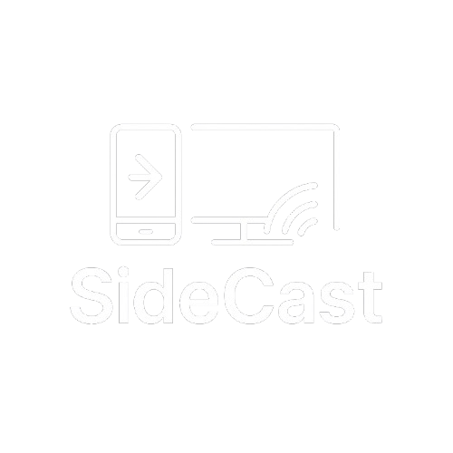
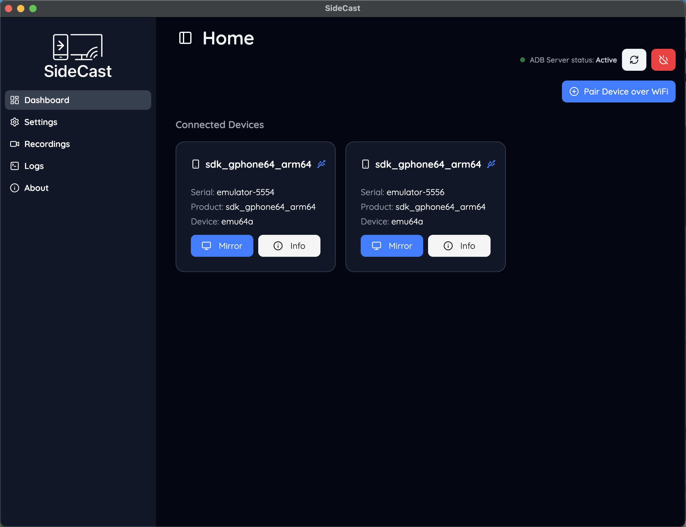
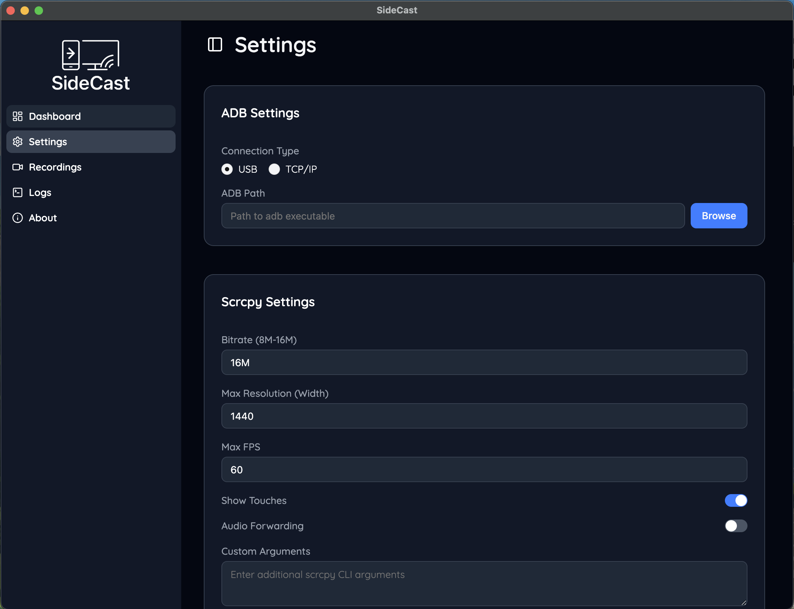
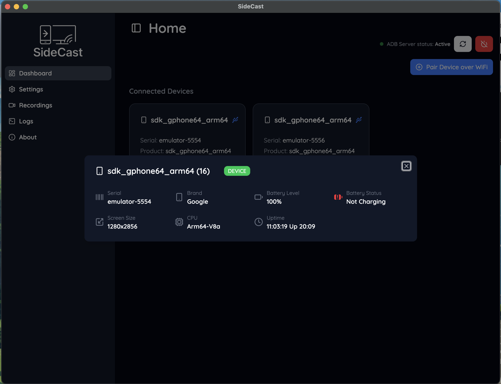
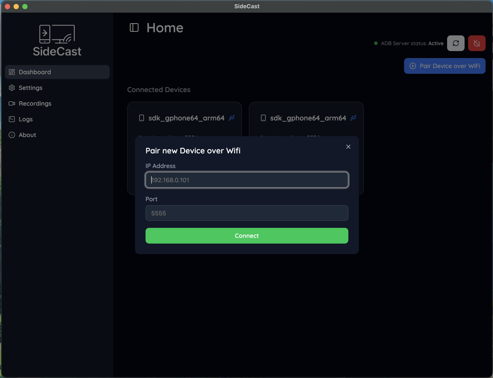

# SideCast

<div align="center">
  
  <br/>
  <p><strong>Mirror and control your Android device seamlessly</strong></p>
  <p>Version 0.1.0 | Alpha Channel</p>
</div>

## 📱 About

**SideCast** is a lightweight, cross-platform desktop application built with Electron that allows you to mirror and interact with your Android devices using ADB and scrcpy. It's fast, simple, and completely local — no internet required.






## ✨ Features

- **Live Screen Mirroring** - Real-time Android device mirroring using scrcpy
- **Multi-Device Support** - Connect and manage multiple Android devices simultaneously
- **USB & Wi-Fi Connection** - Support for both USB and wireless ADB connections. (WiFi Connection is a Work in Progress)
- **Customizable Quality** - Adjust bitrate, resolution, and frame rate settings
- **Screen Recording** - Capture your device screen for later viewing (WIP)
- **Screenshots** - Take instant screenshots of your device (WIP)
- **Real-time Logs** - Monitor ADB and scrcpy logs in real-time (WIP)
- **Device Management** - View detailed device information and connection status
- **Settings Management** - Configure ADB path, timeouts, and scrcpy options
- **Modern UI** - Beautiful, responsive interface built with shadcn/ui and Tailwind CSS

## 🛠️ Built With

- **Frontend**: React 18, TypeScript, Tailwind CSS
- **Desktop**: Electron 30
- **UI Components**: shadcn/ui, Radix UI, Lucide Icons
- **Android Tools**: ADB (Android Debug Bridge), scrcpy
- **Build Tools**: Vite, Electron Builder
- **State Management**: Electron Store for persistent settings

## 📋 Prerequisites

Before using SideCast, ensure you have the following installed:

- **Node.js** (v18 or higher)
- **ADB** (Android Debug Bridge) - [Download here](https://developer.android.com/studio/command-line/adb)
- **scrcpy** - [Download here](https://github.com/Genymobile/scrcpy)

### Android Device Setup

1. **Enable Developer Options** on your Android device
2. **Enable USB Debugging** in Developer Options
3. **Connect via USB** or **pair via Wi-Fi** (see Wi-Fi pairing section below)

## 🚀 Installation

### Development Setup

1. **Clone the repository**

   ```bash
   git clone https://github.com/donymvarkey/side-cast.git
   cd side-cast
   ```

2. **Install dependencies**

   ```bash
   npm install
   ```

3. **Start development server**
   ```bash
   npm run dev
   ```

### Building for Production

```bash
npm run build
```

This will create distributable packages for your platform in the `dist` directory.

## 📖 Usage

### Getting Started

1. **Launch SideCast** - The application will automatically detect connected devices
2. **Check ADB Server** - Ensure the ADB server is running (indicated by the green dot)
3. **Connect Device** - Connect your Android device via USB or Wi-Fi
4. **Start Mirroring** - Click the mirror button next to your device

### Wi-Fi Pairing (WIP)

1. **Connect via USB** first to establish initial connection
2. **Enable Wi-Fi pairing** in the device settings
3. **Use the Wi-Fi pairing dialog** to connect wirelessly
4. **Disconnect USB** once Wi-Fi connection is established

### Settings Configuration

- **ADB Path**: Set custom ADB executable path if not in system PATH
- **Scrcpy Settings**: Configure bitrate, resolution, frame rate, and other options
- **Advanced Settings**: Adjust timeouts and other advanced configurations

## 🏗️ Project Structure

```
├── 📁 .git/ 🚫 (auto-hidden)
├── 📁 .idea/ 🚫 (auto-hidden)
├── 📁 dist-electron/ 🚫 (auto-hidden)
├── 📁 electron/
│   ├── 📄 adb.ts
│   ├── 📄 electron-env.d.ts
│   ├── 📄 main.ts
│   ├── 📄 preload.ts
│   └── 📄 store.ts
├── 📁 node_modules/ 🚫 (auto-hidden)
├── 📁 public/
│   ├── 🖼️ electron-vite.animate.svg
│   ├── 🖼️ electron-vite.svg
│   └── 🖼️ vite.svg
├── 📁 src/
│   ├── 📁 assets/
│   │   ├── 📁 fonts/
│   │   │   ├── 📄 Quicksand-Bold.ttf
│   │   │   ├── 📄 Quicksand-Light.ttf
│   │   │   ├── 📄 Quicksand-Medium.ttf
│   │   │   ├── 📄 Quicksand-Regular.ttf
│   │   │   └── 📄 Quicksand-SemiBold.ttf
│   │   ├── 📁 images/
│   │   │   ├── 📄 index.ts
│   │   │   ├── 🖼️ logo_1.png
│   │   │   ├── 🖼️ logo_2.png
│   │   │   └── 🖼️ logo_side_cast_white.png
│   │   └── 🖼️ react.svg
│   ├── 📁 components/
│   │   ├── 📁 ui/
│   │   │   ├── 📄 badge.tsx
│   │   │   ├── 📄 button.tsx
│   │   │   ├── 📄 card.tsx
│   │   │   ├── 📄 dialog.tsx
│   │   │   ├── 📄 input.tsx
│   │   │   ├── 📄 label.tsx
│   │   │   ├── 📄 radio-group.tsx
│   │   │   ├── 📄 separator.tsx
│   │   │   ├── 📄 sheet.tsx
│   │   │   ├── 📄 sidebar.tsx
│   │   │   ├── 📄 skeleton.tsx
│   │   │   ├── 📄 sonner.tsx
│   │   │   ├── 📄 switch.tsx
│   │   │   ├── 📄 textarea.tsx
│   │   │   └── 📄 tooltip.tsx
│   │   ├── 📄 DeviceDetailsDialog.tsx
│   │   ├── 📄 adb-settings.tsx
│   │   ├── 📄 advanced-settings.tsx
│   │   ├── 📄 app-sidebar.tsx
│   │   ├── 📄 device-list-item.tsx
│   │   ├── 📄 scrcpy-settings.tsx
│   │   └── 📄 wifi-pairing-dialog.tsx
│   ├── 📁 constants/
│   │   ├── 📄 index.ts
│   │   └── 📄 versionInfo.ts
│   ├── 📁 context/
│   │   └── 📄 GlobalContext.ts
│   ├── 📁 hooks/
│   │   └── 📄 use-mobile.ts
│   ├── 📁 layouts/
│   │   └── 📄 MainLayout.tsx
│   ├── 📁 lib/
│   │   └── 📄 utils.ts
│   ├── 📁 screens/
│   │   ├── 📄 About.tsx
│   │   ├── 📄 Devices.tsx
│   │   ├── 📄 Home.tsx
│   │   ├── 📄 Logs.tsx
│   │   ├── 📄 Recordings.tsx
│   │   ├── 📄 Settings.tsx
│   │   └── 📄 index.ts
│   ├── 📁 types/
│   │   ├── 📄 global.d.ts
│   │   └── 📄 index.ts
│   ├── 📁 utils/
│   │   └── 📄 index.ts
│   ├── 📄 App.tsx
│   ├── 📄 Routes.tsx
│   ├── 🎨 index.css
│   ├── 📄 main.tsx
│   └── 📄 vite-env.d.ts
├── 📄 .eslintrc.cjs
├── 🚫 .gitignore
├── 📖 README.md
├── 📄 components.json
├── 📄 electron-builder.json5
├── 🌐 index.html
├── 📄 package-lock.json
├── 📄 package.json
├── 📄 tsconfig.json
├── 📄 tsconfig.node.json
└── 📄 vite.config.ts
```

---

_Generated by FileTree Pro Extension_

## 🔧 Configuration

### ADB Settings

- **ADB Path**: Path to ADB executable
- **Timeout**: ADB command timeout in milliseconds
- **Server Management**: Start/stop ADB server

### Scrcpy Settings

- **Bitrate**: Video bitrate (default: 8000000)
- **Max Resolution**: Maximum resolution (default: 1920)
- **Max FPS**: Maximum frame rate (default: 60)
- **Show Touches**: Display touch events on screen
- **Audio Forwarding**: Forward device audio to computer

## 🐛 Troubleshooting

### Common Issues

1. **Device not detected**

   - Ensure USB debugging is enabled
   - Check ADB server status
   - Try restarting ADB server

2. **Mirroring fails**

   - Verify scrcpy is installed and accessible
   - Check device connection status
   - Review logs for error messages

3. **Wi-Fi connection issues**
   - Ensure device and computer are on same network
   - Check firewall settings
   - Try re-pairing via USB first

### Logs

View real-time logs in the Logs section to diagnose issues with:

- ADB commands
- scrcpy execution
- Device connections
- Application errors

## 🤝 Contributing

1. Fork the repository
2. Create a feature branch (`git checkout -b feature/amazing-feature`)
3. Commit your changes (`git commit -m 'Add amazing feature'`)
4. Push to the branch (`git push origin feature/amazing-feature`)
5. Open a Pull Request

## 📄 License

This project is licensed under the MIT License - see the [LICENSE](LICENSE) file for details.

## 🙏 Acknowledgments

- **[scrcpy](https://github.com/Genymobile/scrcpy)** by Genymobile for the excellent screen mirroring tool
- **[shadcn/ui](https://ui.shadcn.com/)** for the beautiful UI components
- **[Electron](https://www.electronjs.org/)** for the cross-platform desktop framework
- **[Tailwind CSS](https://tailwindcss.com/)** for the utility-first CSS framework

## 📞 Support

- **GitHub Issues**: [Report bugs or request features](https://github.com/donymvarkey/side-cast/issues)
- **Discussions**: [Join the community](https://github.com/donymvarkey/side-cast/discussions)

---

<div align="center">
  <p>Developed with ❤️ by <strong>Dony M Varkey</strong></p>
  <p>© 2025 SideCast</p>
</div>
